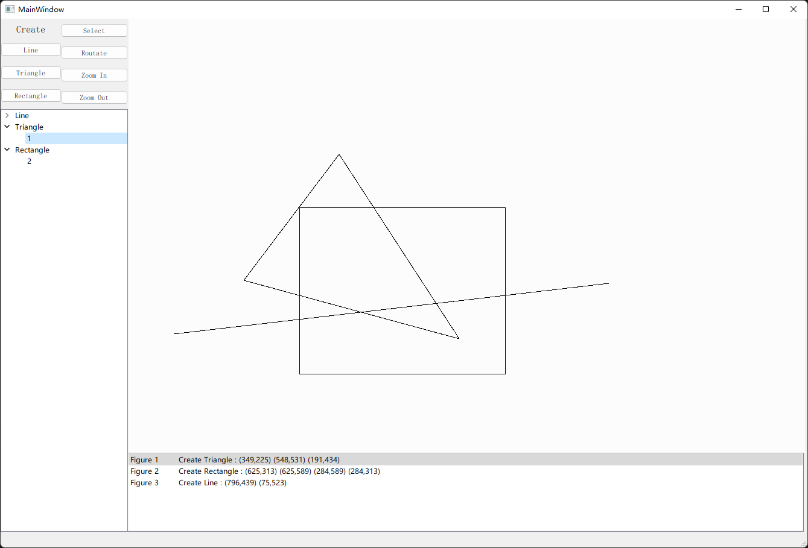

# gld
基于QOpenGLWidget开发的画板，能添加直线、三角形、矩形对象到画板，左侧QTreeView显示画板内现存的对象，下方QListWidget记录操作。

## 状态
- [x] 添加图形对象
- [x] 日志
- [ ] 选择功能
- [ ] 旋转功能
- [ ] 缩放功能

## 文件
- CMakeLists.txt
- glwidget.cpp              **画板**
- glwidget.h
- line.cpp                  **图形：线段**
- line.h
- main.cpp
- mainwindow.cpp            **主界面**
- mainwindow.h
- mainwindow.ui
- README.md
- rectangle.cpp             **图形：矩形**
- rectangle.h
- rectilinearfigure.cpp     **图形基类**
- rectilinearfigure.h
- straightline.cpp          **直线基类**
- straightline.h
- treemodel.cpp             **QTreeView对应的Model**
- treemodel.h
- triangle.cpp              **图形：三角形**
- triangle.h